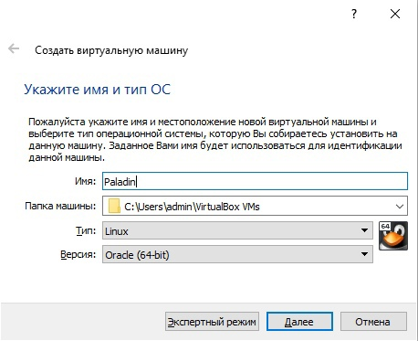
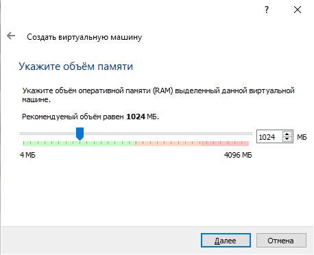
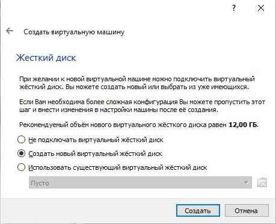
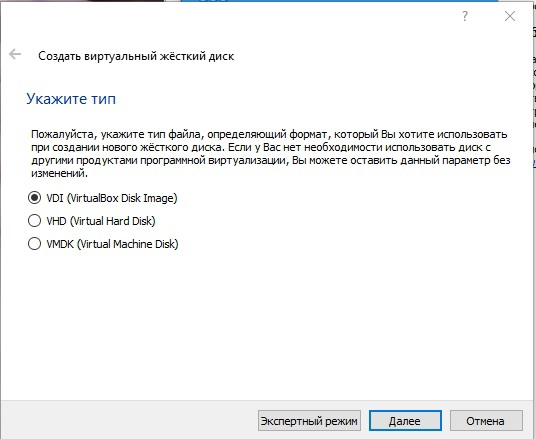
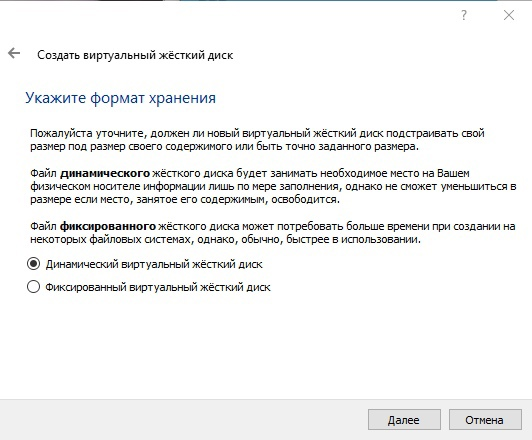
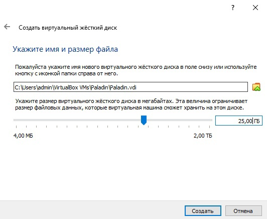
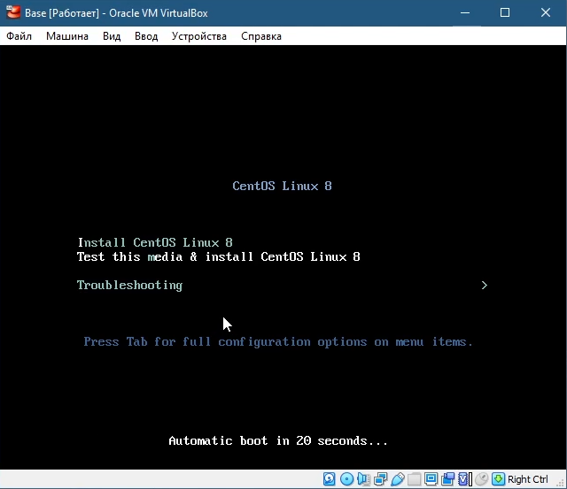
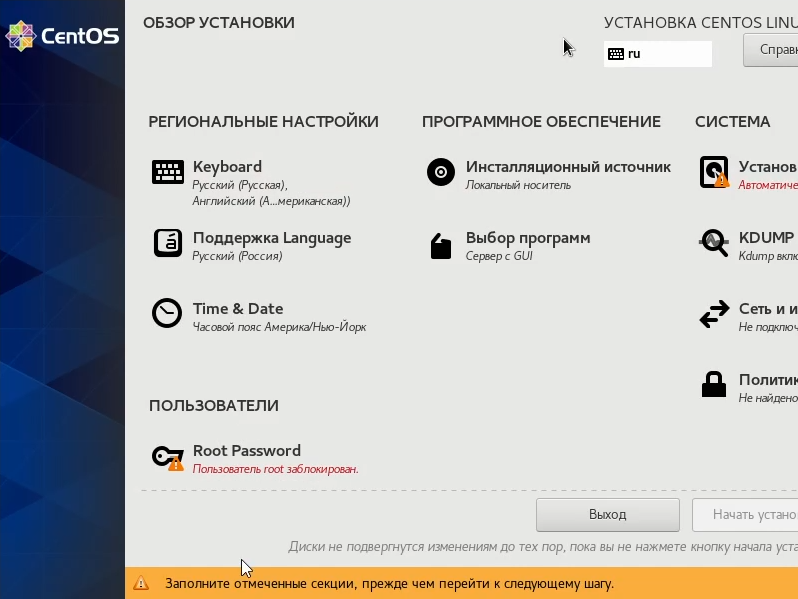
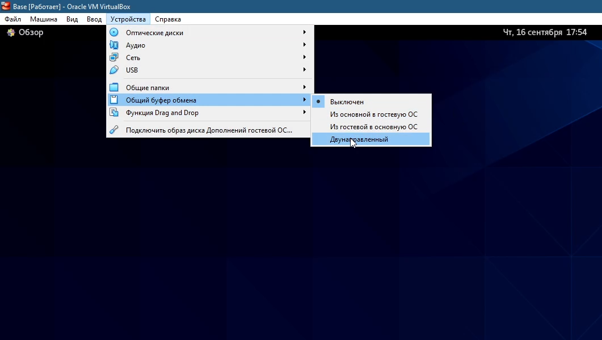

---
## Front matter
lang: ru-RU
title: Лабораторная работа №1
subtitle: Основы информационной безопасности
author:
  - Царитова Нина
institute:
  - Российский университет дружбы народов, Москва, Россия
  - НПМбд-01-19

## i18n babel
babel-lang: russian
babel-otherlangs: english

## Formatting pdf
toc: false
toc-title: Содержание
slide_level: 2
aspectratio: 169
section-titles: true
theme: metropolis
header-includes:
 - \metroset{progressbar=frametitle,sectionpage=progressbar,numbering=fraction}
 - '\makeatletter'
 - '\beamer@ignorenonframefalse'
 - '\makeatother'
---

# Установка OC Linux на виртуалную машину

##Цель выполнения лабораторной работы

- Приобретение практических навыков установки операционной системы на виртуальную машину
- Настройка минимально необходимых для дальнейшей работы сервисов.

##Задачи выполнения лабораторной работы

- Установка операционной системы Linux(дистрибутив CentOS) на виртуальную машину VirtualBox, 
- Настройки минимально необходимых для дальнейшей работы сервисов.

##Ход работы

Создаем виртуальную машину в VirtualBox

{ #fig:001 width=70% }

##Ход работы

Задаем объем оперативой памяти 1024МБ 

{ #fig:002 width=70% }

##Ход работы

Создаем новый динамичекий виртуальный жесткий диск, тип VDI

{ #fig:003 width=70% }

##Ход работы

{ #fig:004 width=70% }

##Ход работы

{ #fig:005 width=70% }

##Ход работы

{ #fig:006 width=70% }

##Ход работы

Установка операционной системы

{ #fig:007 width=70% }

##Ход работы

Настройка операционной системы

{ #fig:008 width=70% }

##Ход работы

Подключаем образ диска Дополнений гостевой ОС

{ #fig:09 width=70% }

# Выводы

Я приобрела практические навыки установки операционной системы на виртуальную машину, настройки ми-
нимально необходимых для дальнейшей работы сервисов.

