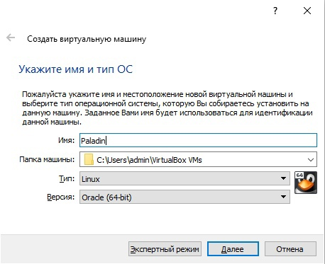
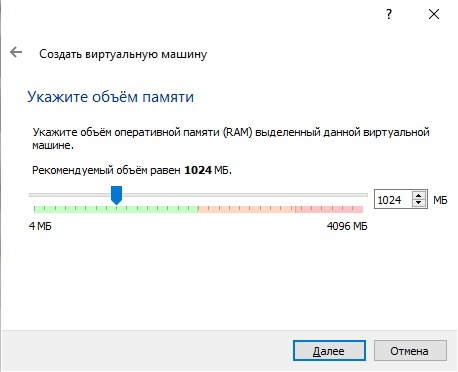
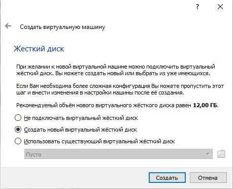
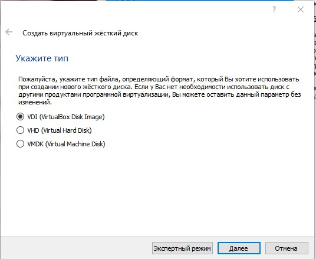
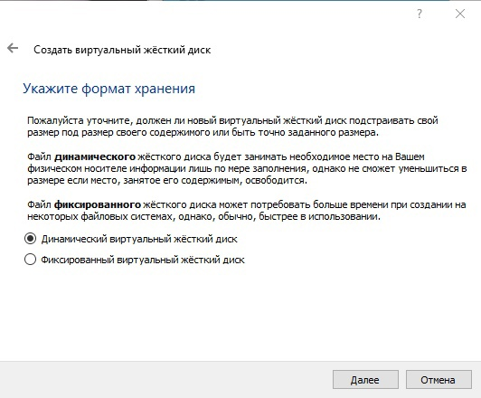
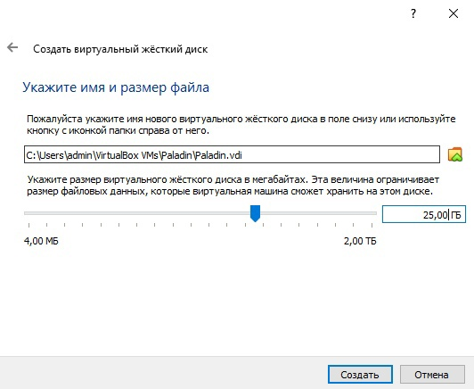
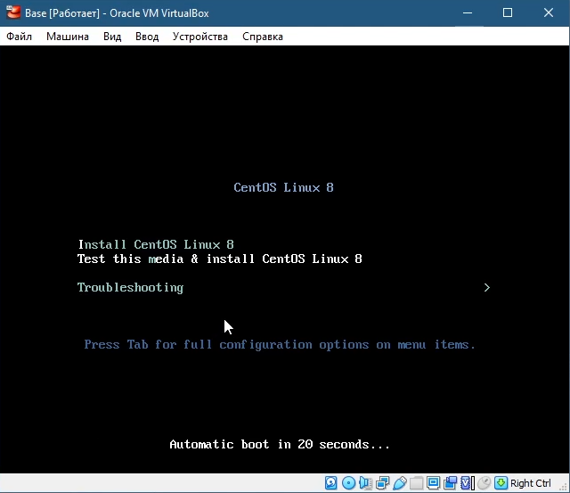
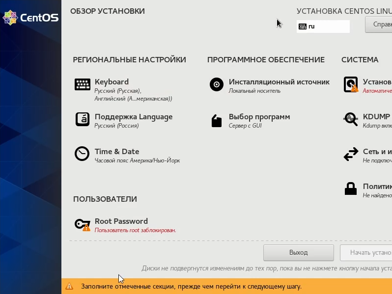
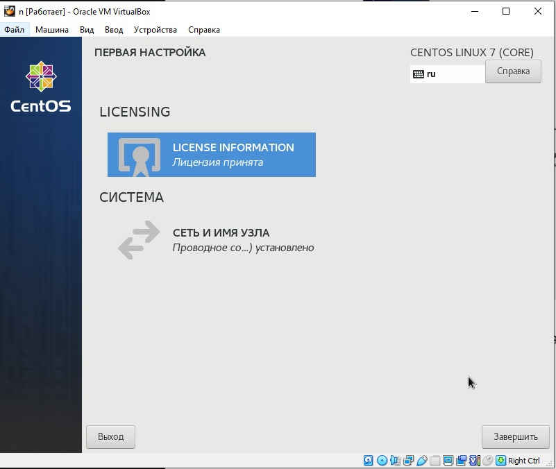
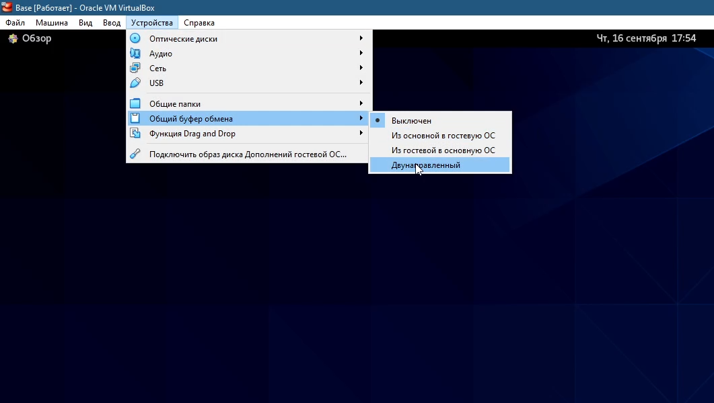

---
## Front matter
title: "Лабораторная работа №1"
subtitle: "Основы информационной безопасности"
author: "Царитова Нина"

## Generic otions
lang: ru-RU
toc-title: "Содержание"

## Bibliography
bibliography: bib/cite.bib
csl: pandoc/csl/gost-r-7-0-5-2008-numeric.csl

## Pdf output format
toc: true # Table of contents
toc-depth: 2
lof: true # List of figures
lot: true # List of tables
fontsize: 12pt
linestretch: 1.5
papersize: a4
documentclass: scrreprt
## I18n polyglossia
polyglossia-lang:
  name: russian
  options:
	- spelling=modern
	- babelshorthands=true
polyglossia-otherlangs:
  name: english
## I18n babel
babel-lang: russian
babel-otherlangs: english
## Fonts
mainfont: PT Serif
romanfont: PT Serif
sansfont: PT Sans
monofont: PT Mono
mainfontoptions: Ligatures=TeX
romanfontoptions: Ligatures=TeX
sansfontoptions: Ligatures=TeX,Scale=MatchLowercase
monofontoptions: Scale=MatchLowercase,Scale=0.9
## Biblatex
biblatex: true
biblio-style: "gost-numeric"
biblatexoptions:
  - parentracker=true
  - backend=biber
  - hyperref=auto
  - language=auto
  - autolang=other*
  - citestyle=gost-numeric
## Pandoc-crossref LaTeX customization
figureTitle: "Рис."
tableTitle: "Таблица"
listingTitle: "Листинг"
lofTitle: "Список иллюстраций"
lolTitle: "Листинги"
## Misc options
indent: true
header-includes:
  - \usepackage{indentfirst}
  - \usepackage{float} # keep figures where there are in the text
  - \floatplacement{figure}{H} # keep figures where there are in the text
---

# Цель работы

Приобретение практических навыков установки операционной системы на виртуальную машину, настройки ми-
нимально необходимых для дальнейшей работы сервисов.

# Выполнение лабораторной работы
Для установки на виртуальную машину VirtualBox операционной системы Linux (дистрибутив CentOS) в нашем случае использовалась внешняя операционная система Windows.

В VirtualBox нажимаем "Машина" - "Создать" и задаем имя "Base для нашей будущей операционной системы. Тип - Linux, версия - Red Hat (64-bit).

{ #fig:001 width=70% }

Задаем объем оперативой памяти 1024МБ 

{ #fig:002 width=70% }

Создаем новый динамичекий виртуальный жесткий диск, тип VDI

{ #fig:003 width=70% }

{ #fig:004 width=70% }

{ #fig:005 width=70% }

{ #fig:006 width=70% }

Первоначальные основные настройки виртуальной машины заданы, теперь запускаем нашу операционную систему, выбираем образ дистрибутива CentOS.

Теперь стали доступны варианты непосредственно установки дистрибутива и продолжение загрузки в тестовом режиме без установки. В дальнейшем нам необходимо будетпользоваться данной операционной системой, устанавливать приложения, сохранять файлы, поэтому выбираем пункт установки.

{ #fig:007 width=70% }

Отобразился обзор установки, где мы можем задать настройки уже нашей операционной системы: задать язык раскладки, пароль для суперпользователя, выбрать часовой пояс и другие.

Выбираем русский язык, где это возможно, указываем ранее созданный виртуальный жесткий диск для системы и нажимаем "Начать установку".

{ #fig:008 width=70% }

После установки необходимо принять лицензию и по желанию создать пользователей.

Теперь можно завершать установку и переходить в CentOS.

{ #fig:009 width=70% }

Осталось установить дополнения гостевой ОС. Для этого в виртуальной машине нажимаем "Устройства" - "Подключить образ диска Дополнений гостевой ОС". После чего запускается установка в терминале.

В итоге получили готовую к использованию операционную систему Linux (дистрибутив CentOS) с установленными дополнениями гостевой ОС, что позволяет менять разрешение экрана, использовать двунаправленный буфер обмена с внешней ОС и др.

{ #fig:010 width=70% }

# Выводы

Я приобрела практические навыки установки операционной системы на виртуальную машину, настройки ми-
нимально необходимых для дальнейшей работы сервисов.

