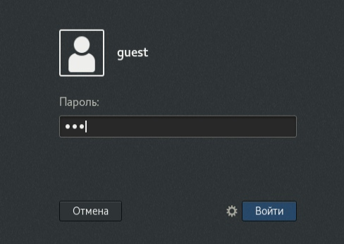
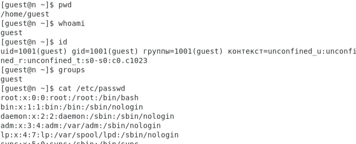
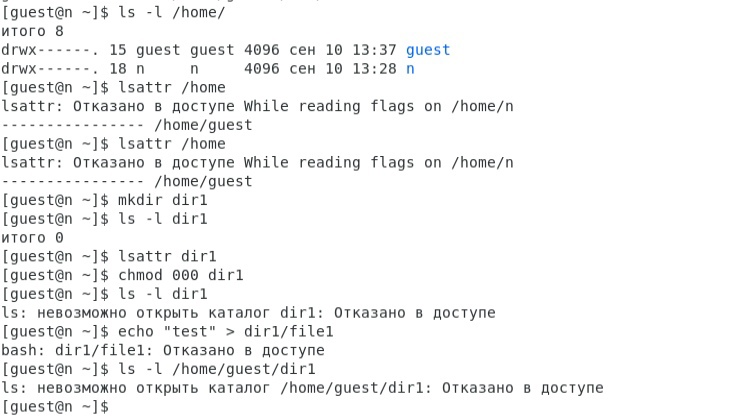
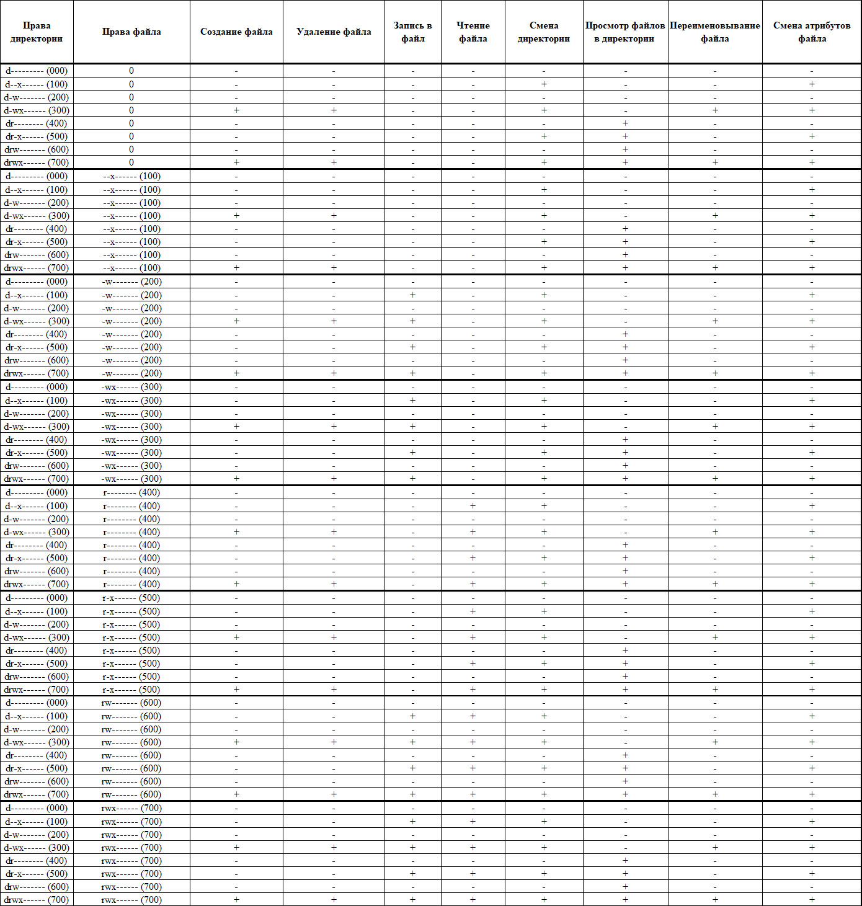
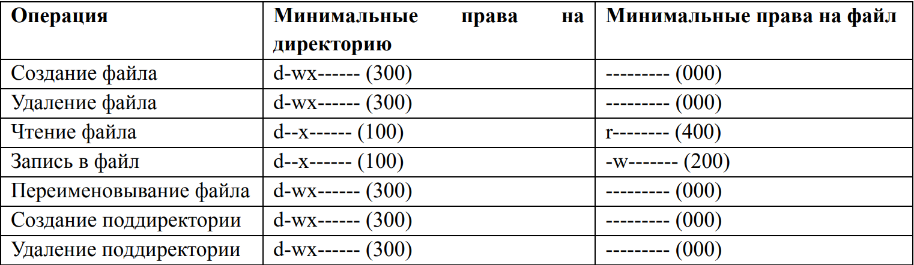

---
## Front matter
lang: ru-RU
title: Лабораторная работа №2
author: |
	Царитова Нина 
	НПМбд-01-19

## i18n babel
babel-lang: russian
babel-otherlangs: english

## Formatting pdf
toc: false
toc-title: Содержание
slide_level: 2
aspectratio: 169
section-titles: true
theme: metropolis
header-includes:
 - \metroset{progressbar=frametitle,sectionpage=progressbar,numbering=fraction}
 - '\makeatletter'
 - '\beamer@ignorenonframefalse'
 - '\makeatother'
---

# Работа с виртуальной машиной

## Цель выполнения лабораторной работы

- Получение практических навыков работы в консоли с атрибутами файлов;
- Закрепление теоретических основ дискреционного разграничения доступа в современных системах с открытым кодом на базе ОС Linux.

## Задачи выполнения работы

- Создать новую учетную запись
- Работа с атрибутами

## Выполнение

- Создала новую учетную запись

{ #fig:001 width=70% }

## Выполнение

- Уточнила имя пользователя, id, /etc/passwd

{ #fig:002 width=70% }

## Выполнение

- Работа с атрибутами, проверка доступа

{ #fig:003 width=70% }

## Выполнение

- Установленные права и разрешённые действия

{ #fig:004 width=70% }

## Выполнение

- Минимальные права для совершения операций

{ #fig:005 width=70% }

## Выводы

- Получила практические навыки работы в консоли с атрибутами файлов;
- Закрепила теоретические основы дискреционного разграничения доступа в современных системах с открытым кодом на базе ОС Linux.

