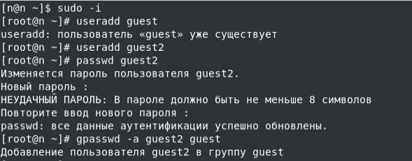
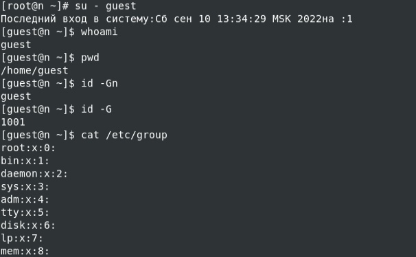
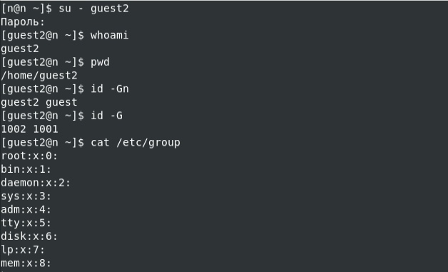
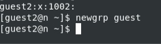
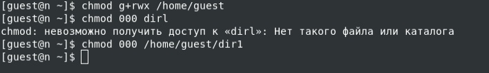
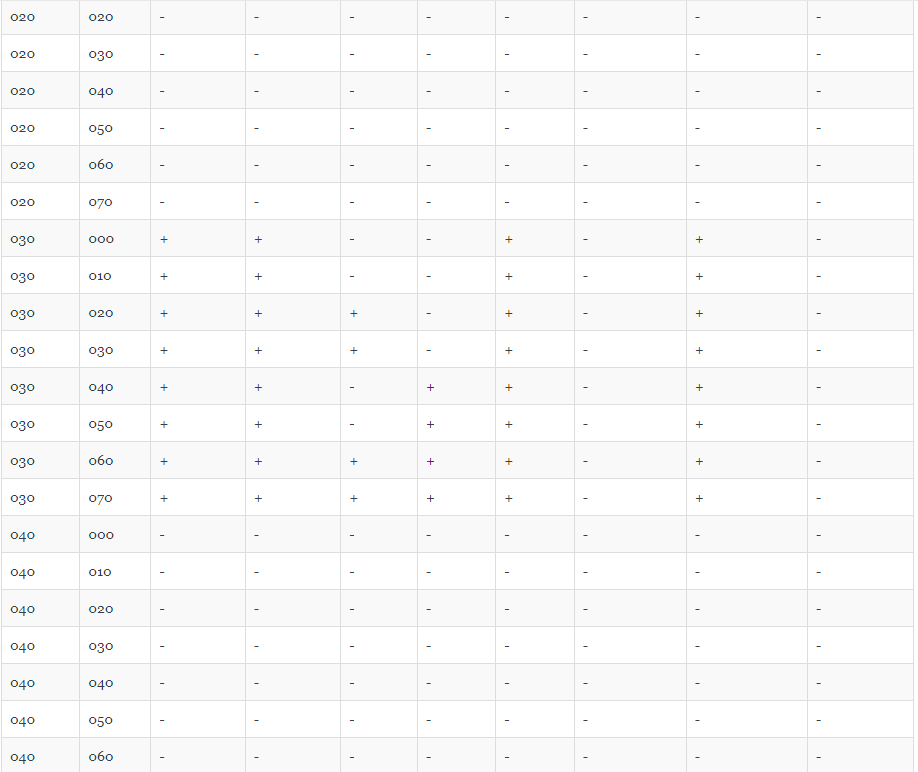
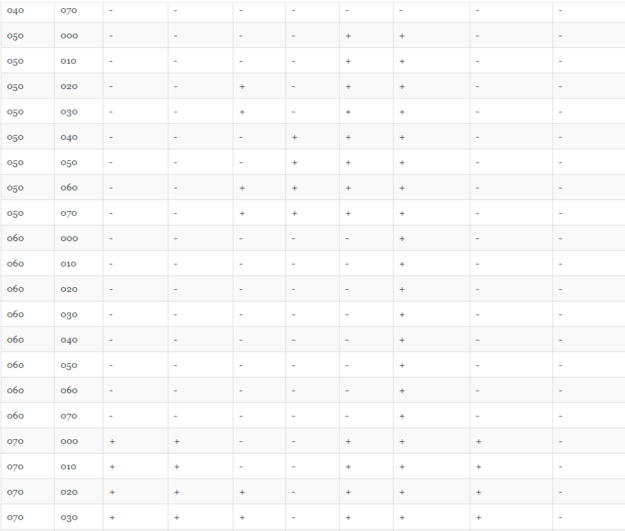
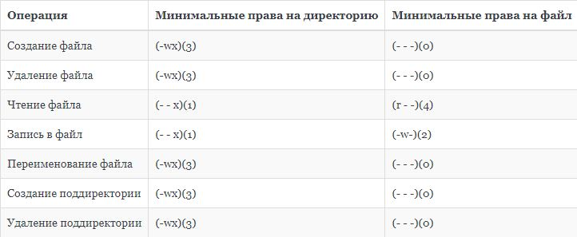

---
## Front matter
title: "Лабораторная работа №3"
author: "Царитова Нина - НПМбд-01-19"

## Generic otions
lang: ru-RU
toc-title: "Содержание"

## Bibliography
bibliography: bib/cite.bib
csl: pandoc/csl/gost-r-7-0-5-2008-numeric.csl

## Pdf output format
toc: true # Table of contents
toc-depth: 2
lof: true # List of figures
fontsize: 12pt
linestretch: 1.5
papersize: a4
documentclass: scrreprt
## I18n polyglossia
polyglossia-lang:
  name: russian
  options:
	- spelling=modern
	- babelshorthands=true
polyglossia-otherlangs:
  name: english
## I18n babel
babel-lang: russian
babel-otherlangs: english
## Fonts
mainfont: PT Serif
romanfont: PT Serif
sansfont: PT Sans
monofont: PT Mono
mainfontoptions: Ligatures=TeX
romanfontoptions: Ligatures=TeX
sansfontoptions: Ligatures=TeX,Scale=MatchLowercase
monofontoptions: Scale=MatchLowercase,Scale=0.9
## Biblatex
biblatex: true
biblio-style: "gost-numeric"
biblatexoptions:
  - parentracker=true
  - backend=biber
  - hyperref=auto
  - language=auto
  - autolang=other*
  - citestyle=gost-numeric
## Pandoc-crossref LaTeX customization
figureTitle: "Рис."
tableTitle: "Таблица"
listingTitle: "Листинг"
lofTitle: "Список иллюстраций"
lolTitle: "Листинги"
## Misc options
indent: true
header-includes:
  - \usepackage{indentfirst}
  - \usepackage{float} # keep figures where there are in the text
  - \floatplacement{figure}{H} # keep figures where there are in the text
---

# Цель работы

Получение практических навыков работы в консоли с атрибутами файлов для групп пользователей

## Создание учетных записей и вход в систему от двух пользователей

Создаём новые учётные записи guest и guest2, используя учетную запись администратора и команду `useradd`.

После этого зададим пароль с помощью команды `passwd`, используя учетную запись администратора. 

Добавляем пользователя guest2 в группу guest командой `gpasswd -a guest2 guest`.

{ #fig:001 width=70% }

## Принадлежность к группам

Входим в систему в одной консоли от имени пользователя guest, определяем директорию, в которой находимся, с помощью команды pwd.

Аналогичные действия выполняем во второй консоли для пользователя guest2. 

{ #fig:002 width=70% }
{ #fig:003 width=70% }

Для обоих пользователей уточняем имя пользователя, группу, кто в неё входит и к каким группам принадлежат пользователи.

С помощью команд `groups guest` и `groups guest2` определяем в какие группы входят пользователи guest и guest2. Результат индентичен выводу команд `id -Gn` и `id -G`. 

Также эту же информацию можно было получить, воспользовавшись командой `cat /etc/group`.

С помощью команды `newgrp guest` регистрируем пользователя guest2 в группе guest.

{ #fig:005 width=70% }

## Права и атрибуты

От имени пользователя guest изменяем права директории /home/guest, разрешив все действия для пользователей группы при помощи команды `chmod g+rwx /home/guest`.

От имени пользователя guest снимаем с директории /home/guest/dir1 все атрибуты командой `chmod 000 dirl`. (рис. -@fig:004)

{ #fig:004 width=70% }

## Таблица 3.1

Меняя атрибуты у директории dir1 и файла file1 от имени пользователя guest и делая проверку от пользователя guest2, заполняем таблицу: (рис. -@fig:005 — -@fig:008)

{ #fig:006 width=50% }
{ #fig:007 width=50% }
{ #fig:008 width=50% }
{ #fig:009 width=50% }

## Таблица 3.2

На основании заполненной таблицы определяем те или иные минимально необходимые права для выполнения пользователем guest2 операций внутри директории dir1 и заполняем таблицу 3.2. (рис. -@fig:009)

{ #fig:010 width=70% }
# Выводы

Я получила практические навыкы работы в консоли с атрибутами файлов для групп пользователей

# Список литературы{.unnumbered}

- Медведовский И.Д., Семьянов П.В., Платонов В.В. Атака через Internet. — НПО "Мир и семья-95",  1997. — URL: http://bugtraq.ru/library/books/attack1/index.html
- Медведовский И.Д., Семьянов П.В., Леонов Д.Г.  Атака на Internet. — Издательство ДМК, 1999. — URL: http://bugtraq.ru/library/books/attack/index.html
- Запечников С. В. и др. Информационн~пасность открытых систем. Том 1. — М.: Горячаая линия -Телеком, 2006.

