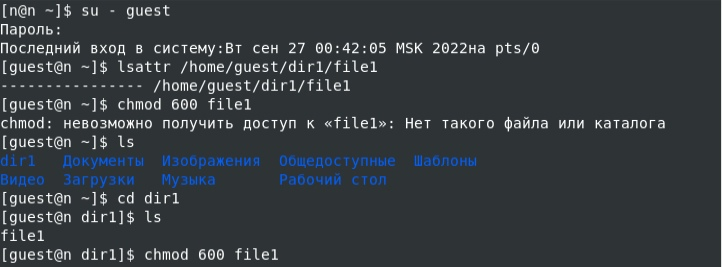
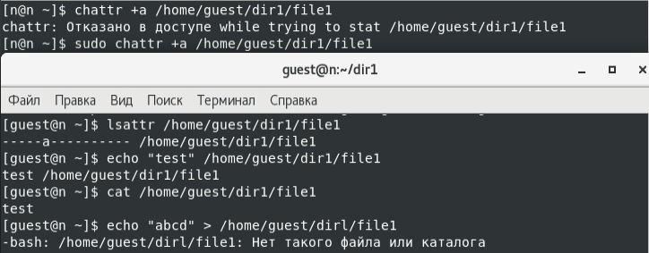
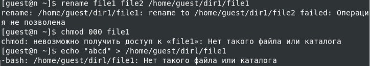
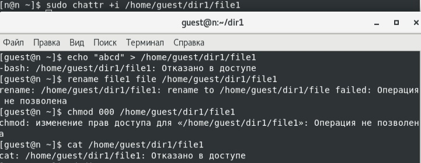

---
## Front matter
lang: ru-RU
title: Лабораторная работа №4
author:
  - Царитова Н.А.
  - НПМбд-01-19
institute:
  - Российский университет дружбы народов, Москва, Россия

## i18n babel
babel-lang: russian
babel-otherlangs: english

## Formatting pdf
toc: false
toc-title: Содержание
slide_level: 2
aspectratio: 169
section-titles: true
theme: metropolis
header-includes:
 - \metroset{progressbar=frametitle,sectionpage=progressbar,numbering=fraction}
 - '\makeatletter'
 - '\beamer@ignorenonframefalse'
 - '\makeatother'
---

## Цель выполнения лабораторной работы

- Получение практических навыков работы в консоли с атрибутами файлов для групп пользователей.

## Установка расширенного атрибута a

- От имени суперпользователя задаем расширенный атрибут a на файл file1

- Проверяем атрибуты файла от имени пользователя guest

{ #fig:001 width=70% }

## Работа с файлом с расширенным атрибутом a
- Дозаписываем текст в файл file1, прочитал файл

- Попробуем перезаписать информацию, а также снять атрибуты.

{ #fig:002 width=70% }

## Работа с файлом без расширенного атрибута a

- Снимаем расширенный атрибут a

- Попробуем повторить предыдущие операции

{ #fig:003 width=70% }

## Работа с файлом с расширенным атрибутом i

- Установливаем расширенный атрибут i

- Повторяем операции: дозапись, перезапись, чтение, переименование

{ #fig:004 width=70% }

## Выводы

- В ходе выполнения лабораторной работы получили практические навыки работы в консоли с расширенными атрибутами файлов «а» и «i»

