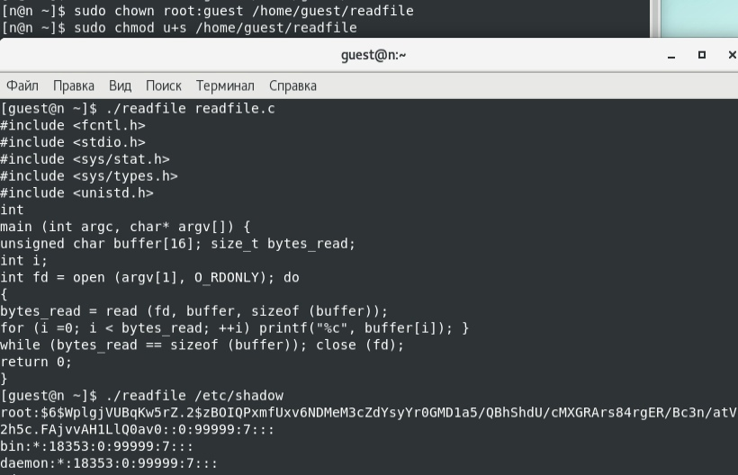

---
## Front matter
lang: ru-RU
title: Лабораторная работа №6
author: 
  - Царитова Нина 
  - НПМбд-01-19
institute:
  - Российский университет дружбы народов, Москва, Россия

## i18n babel
babel-lang: russian
babel-otherlangs: english

## Formatting pdf
toc: false
toc-title: Содержание
slide_level: 2
aspectratio: 169
section-titles: true
theme: metropolis
header-includes:
 - \metroset{progressbar=frametitle,sectionpage=progressbar,numbering=fraction}
 - '\makeatletter'
 - '\beamer@ignorenonframefalse'
 - '\makeatother'
---

## Цель работы

Изучить особенности работы с дополнительными атрибутами SetUID, SetGID и Sticky битами и их влияние на работу с файлами при их наличии и отсутствии.

# Выполнение лабораторной работы

## Ход работы

Создадим программу simpleid.c и скомпилируем ее с помощью команды gcc и убеждаемся, что файл действительно создан. Далее запускаем исполняемый файл через ./. Вывод написанной программы совпадает с выводом команды id 

{ #fig:001 width=70% }

## Ход работы

Усложним программу, скомпилируем и запустим (файл simpleid2)

{ #fig:002 width=70% }

## Ход работы

От имени суперпользователя сменим владельца файла simpleid2 на root и установим SetUID-бит. 

{ #fig:003 width=70% }

## Ход работы

Запускаем программу simpleid2 и комаду id. Появились отличия в uid строках 

{ #fig:004 width=70% }

## Ход работы

Проделываем выше описанные действия для SetGID-бита. Появились отличия в gid строках 

{ #fig:005 width=70% }

## Ход работы

Создадим программу readfile.c и откомпилируем эту программу командой gcc. Меняем владельца файла readfile.c и отнимаем у пользователя guest право на чтение. При попытке прочитать файл от имени пользователя guest возникает ошибка

{ #fig:006 width=70% }

## Ход работы

Меняем владельца файла readfile и устанавливаем на него SetUID-бит. Запускаем исполняемый файл и убеждаемся, что программа может прочитать файлы readfile.c и /etc/shadow

{ #fig:007 width=70% }

## Исследование Sticky-бита

Выполняя команду ls -l выявняем, что на каталоге /tmp установлен Sticky-бит. Это видно, т.к. в конце написана t. Далее от имени пользователя guest создаём файл /tmp/file01.txt. Потом просматриваем атрибуты только что созданного файла и даём всем пользователям право на чтение и запись

{ #fig:008 width=70% }

## Исследование Sticky-бита

От имени пользователя guest2 читаем файл file01.txt командой cat. Повторяем предыдущие шаги. При попытке удалить файл возникла ошибка.

{ #fig:009 width=70% }

## Исследование Sticky-бита

Повышаем права до суперпользователя и снимаем с директории /tmp Sticky-бит. Покидаем режим суперпользователя командой exit 

{ #fig:012 width=70% }

## Исследование Sticky-бита

Убеждаемся через команду ls -l, что Sticky-бит действительно отсутсвует. Далее повторяем действия от имени пользователя guest2. описанные выше. В этот раз удалось удалить файл file01.txt даже при условии, что guest2 не является его владельцем

{ #fig:010 width=70% }

## Исследование Sticky-бита

Повышаем права до суперпользователя и возвращает Sticky-бит на каталог /tmp 

{ #fig:011 width=70% }

# Выводы

Изучила механизмы изменения идентификаторов и получила практические навыки по работе с SetUID, SetGID и Sticky битами и узнала об их особенностях и влиянии на файлы и директории.

