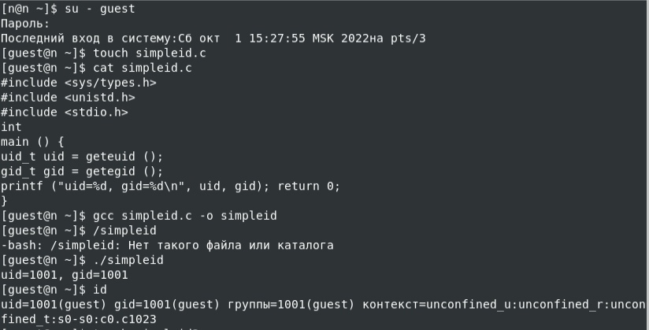
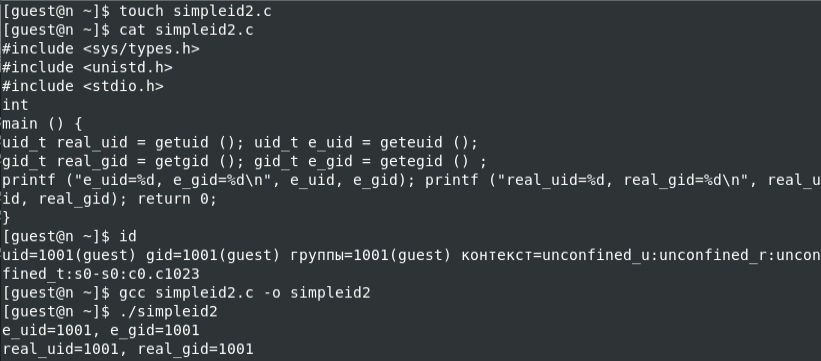
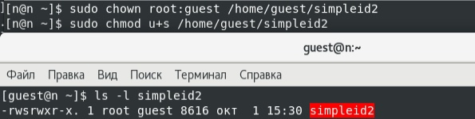
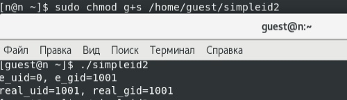
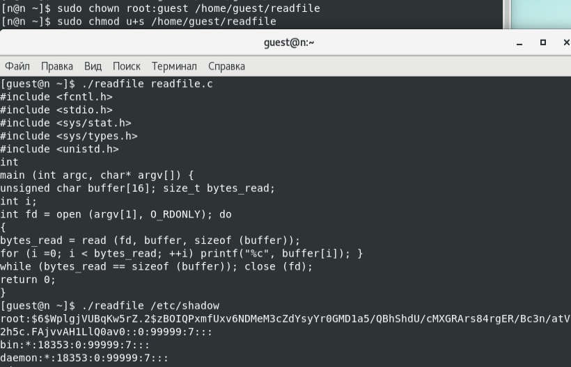
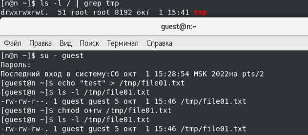
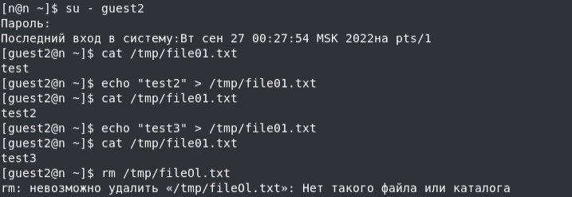
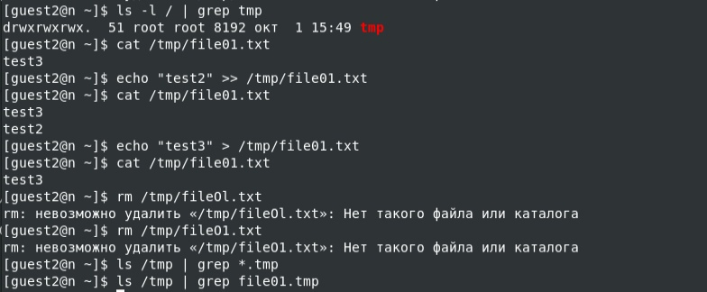

---
## Front matter
title: "Лабораторная работа №6"
author: "Царитова Нина, НПМбд-01-19"

## Generic otions
lang: ru-RU
toc-title: "Содержание"

## Bibliography
bibliography: bib/cite.bib
csl: pandoc/csl/gost-r-7-0-5-2008-numeric.csl

## Pdf output format
toc: true # Table of contents
toc-depth: 2
lof: true # List of figures
fontsize: 12pt
linestretch: 1.5
papersize: a4
documentclass: scrreprt
## I18n polyglossia
polyglossia-lang:
  name: russian
  options:
	- spelling=modern
	- babelshorthands=true
polyglossia-otherlangs:
  name: english
## I18n babel
babel-lang: russian
babel-otherlangs: english
## Fonts
mainfont: PT Serif
romanfont: PT Serif
sansfont: PT Sans
monofont: PT Mono
mainfontoptions: Ligatures=TeX
romanfontoptions: Ligatures=TeX
sansfontoptions: Ligatures=TeX,Scale=MatchLowercase
monofontoptions: Scale=MatchLowercase,Scale=0.9
## Biblatex
biblatex: true
biblio-style: "gost-numeric"
biblatexoptions:
  - parentracker=true
  - backend=biber
  - hyperref=auto
  - language=auto
  - autolang=other*
  - citestyle=gost-numeric
## Pandoc-crossref LaTeX customization
figureTitle: "Рис."
tableTitle: "Таблица"
listingTitle: "Листинг"
lofTitle: "Список иллюстраций"
lolTitle: "Листинги"
## Misc options
indent: true
header-includes:
  - \usepackage{indentfirst}
  - \usepackage{float} # keep figures where there are in the text
  - \floatplacement{figure}{H} # keep figures where there are in the text
---

# Цель работы

Изучить особенности работы с дополнительными атрибутами SetUID, SetGID и Sticky битами и их влияние на работу с файлами при их наличии и отсутствии.

# Выполнение лабораторной работы

## Создание программы

Создадим программу simpleid.c и скомпилируем ее с помощью команды gcc и убеждаемся, что файл действительно создан. Далее запускаем исполняемый файл через ./. Вывод написанной программы совпадает с выводом команды id 

{ #fig:001 width=70% }

Усложним программу, скомпилируем и запустим (файл simpleid2)

{ #fig:002 width=70% }

От имени суперпользователя сменим владельца файла simpleid2 на root и установим SetUID-бит. 

{ #fig:003 width=70% }

Запускаем программу simpleid2 и комаду id. Появились отличия в uid строках 

{ #fig:004 width=70% }

Проделываем выше описанные действия для SetGID-бита. Появились отличия в gid строках 

{ #fig:005 width=70% }

Создадим программу readfile.c и откомпилируем эту программу командой gcc. Меняем владельца файла readfile.c и отнимаем у пользователя guest право на чтение. При попытке прочитать файл от имени пользователя guest возникает ошибка

{ #fig:006 width=70% }

Меняем владельца файла readfile и устанавливаем на него SetUID-бит. Запускаем исполняемый файл и убеждаемся, что программа может прочитать файлы readfile.c и /etc/shadow

{ #fig:007 width=70% }

## Исследование Sticky-бита

Выполняя команду ls -l выявняем, что на каталоге /tmp установлен Sticky-бит. Это видно, т.к. в конце написана t. Далее от имени пользователя guest создаём файл /tmp/file01.txt. Потом просматриваем атрибуты только что созданного файла и даём всем пользователям право на чтение и запись

{ #fig:008 width=70% }

От имени пользователя guest2 читаем файл file01.txt командой cat. Повторяем предыдущие шаги. При попытке удалить файл возникла ошибка.

{ #fig:009 width=70% }

Повышаем права до суперпользователя и снимаем с директории /tmp Sticky-бит. Покидаем режим суперпользователя командой exit 

{ #fig:012 width=70% }

Убеждаемся через команду ls -l, что Sticky-бит действительно отсутсвует. Далее повторяем действия от имени пользователя guest2. описанные выше. В этот раз удалось удалить файл file01.txt даже при условии, что guest2 не является его владельцем

{ #fig:010 width=70% }

Повышаем права до суперпользователя и возвращает Sticky-бит на каталог /tmp 

{ #fig:011 width=70% }

# Выводы

Изучила механизмы изменения идентификаторов и получила практические навыки по работе с SetUID, SetGID и Sticky битами и узнала об их особенностях и влиянии на файлы и директории.

# Список литературы

- Медведовский И.Д., Семьянов П.В., Платонов В.В. Атака через Internet. — НПО "Мир и семья-95",  1997. — URL: http://bugtraq.ru/library/books/attack1/index.html
- Медведовский И.Д., Семьянов П.В., Леонов Д.Г.  Атака на Internet. — Издательство ДМК, 1999. — URL: http://bugtraq.ru/library/books/attack/index.html
- Запечников С. В. и др. Информационн~пасность открытых систем. Том 1. — М.: Горячаая линия -Телеком, 2006.
