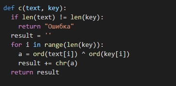

---
## Front matter
lang: ru-RU
title: Лабораторная работа №8
author: 
  - Царитова Нина
institute:
  - Российский университет дружбы народов, Москва, Россия

## i18n babel
babel-lang: russian
babel-otherlangs: english

## Formatting pdf
toc: false
toc-title: Содержание
slide_level: 2
aspectratio: 169
section-titles: true
theme: metropolis
header-includes:
 - \metroset{progressbar=frametitle,sectionpage=progressbar,numbering=fraction}
 - '\makeatletter'
 - '\beamer@ignorenonframefalse'
 - '\makeatother'
---

## Цели и задачи

- Освоить на практике применение однократного гаммирования при работе с различными текстами на одном ключе.

## Ход лабораторной работы

# Функция шифрования

Cоздаём функцию, которая осуществляет однократное гаммирование посредством побитового XOR

{ #fig:001 width=70% }

# Исходные данные

Задаём две равные по длине текстовые строки и создаём случайный символьный ключ такой же длины и осуществляем шифрование двух текстов по ключу с помощью написанной функции.
Создаём переменную, которая, прогнав два шифрованных текста через побитовый XOR, поможет злоумышленнику получить один текст, зная другой, без ключа

{ #fig:002 width=70% }

# Выводы

- Освоено на практике применение режима однократного гаммирования
- Изучены недостатки однократного гаммирования

